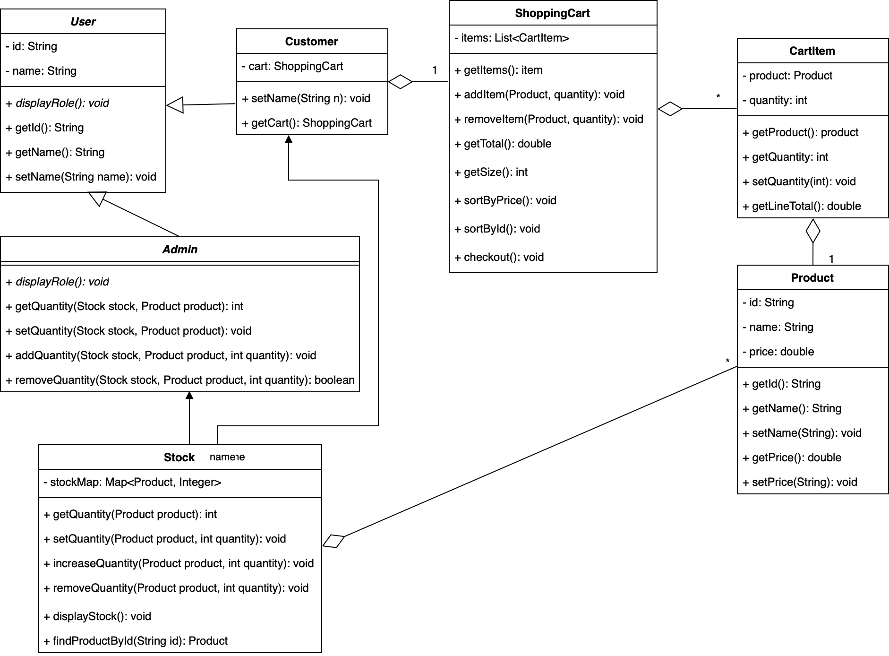

[](https://classroom.github.com/a/LXtbW2-T)

# ICS4U OOP Design Project



## Overview

This project models a simple online store featuring two user roles—Admin and Customer. Admins can manage product inventory, while Customers can browse products, add or remove items with live stock validation, sort their shopping cart, and checkout with tax calculation.

This Java-based console application simulates a simple online store, demonstrating core Object-Oriented Programming principles: **encapsulation**, **abstraction**, **inheritance**, **polymorphism**, and **aggregation**. Customers can browse products, add/remove items with stock validation, sort their cart, and checkout with tax calculation. Admins can log in with a password to view and manage inventory.

---

## 📦 Project Structure

```
src/
 ├─ Main.java            # Entry point: Admin & Customer menus
 ├─ models/
 │   ├─ User.java         # «abstract» base class for all users
 │   ├─ Admin.java        # extends User, manages stock
 │   ├─ Customer.java     # extends User, holds a ShoppingCart
 │   ├─ Product.java      # product ID, name, price
 │   ├─ CartItem.java     # wraps Product + quantity + line total
 │   ├─ ShoppingCart.java # holds CartItems, add/remove/sort/checkout
 │   └─ Stock.java        # maintains Map<Product,int> stock levels
```

---

## Main Features

- **Admin Mode**: Secure login with password to view, add, or remove stock.
- **Customer Mode**: Browse live stock, add/remove specific quantities, and view cart.
- **Sorting**: Sort shopping cart items by product ID or price.
- **Checkout**: Calculate subtotal, HST (13%), and total; then clear the cart.

## How to Run

1. **Compile** the source files:
   ```bash
   javac -d out src/models/*.java src/Main.java
   ```
2. **Execute** the application:
   ```bash
   java -cp out Main
   ```

> Developed by Alvin Lau for the ICS4U 2-14 OOP Design Project.
